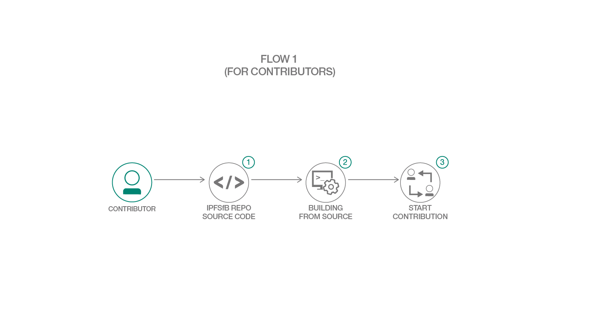
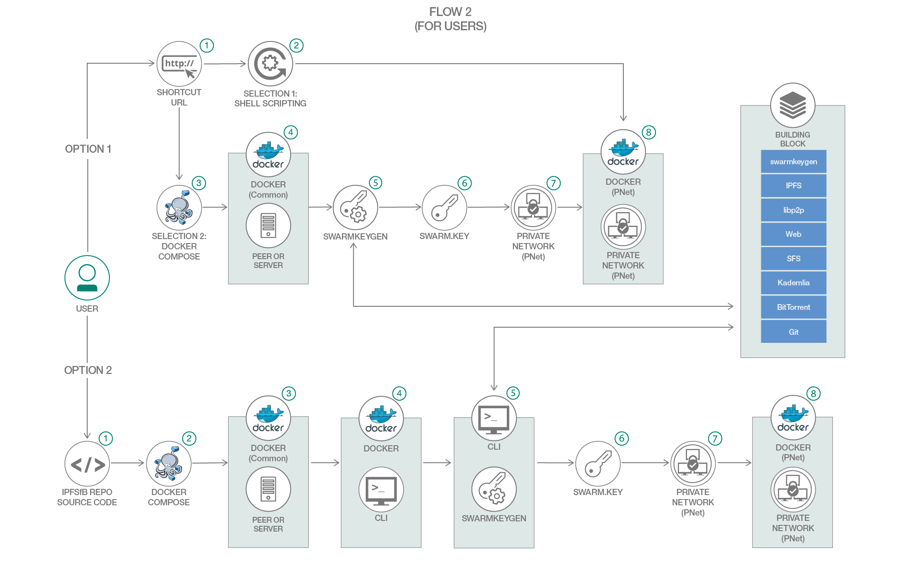

# InterPlanetary File System for Business (IPFSfB)

[](https://travis-ci.org/IBM/IPFSfB)

## Forked Repository Note

This forked repository of IBM/IPFSfB is one of the most renowned versions of IPFSfB, the IPFSfB orginal author's repository.
Where the newest version of IPFSfB will arrive, there is a place.

### Note for New Features

This repository empowers users to leverage the nature of the IPFS Web UI feature, refined p2p, p2s and p2sp network to add server functionality of Web UI, and add server-only (so) senario.

- Private IPFS Web UI for ipfs-server with download and upload functionalites.
- New desgin of server-only (so) network.
- Renewed p2p, p2s, and p2sp networks for private IPFS Web UI compatibility.

### Note for Private IPFS Web UI

The private IPFS Web UI is not ready for production usage if only bringing a network up by a single script like `./pnet up <network>`. To use all Web UI functionalities, we should configure it through [Private IPFS Web UI tutorial](docs/tutorial/private-ipfs-web-ui.md).

## Original Edition

This repository contains instructions to build a private, unstructured data storage network for any blockchain on distributed file system, InterPlanetary File System for Business (IPFSfB), using crypto tools and Docker images with Docker and Docker Compose to provision the enterprise blockchain storage network.

## Overview

InterPlanetary File System for Business (IPFSfB) is based on InterPlanetary File System, which aim to provide an enterprise form, unstructured data storage network for any blockchain.

## Flow

Currently we have two flows for each contributors and users.

### Flow 1: for contributors



The contributor flow tells you how to contribute to IPFSfB. You can also refer to the [contributors guide](CONTRIBUTING.md).

### Flow 2: for users



The user flow corresponds how to set up a private network, which you can refer to [running a private network](#1-running-a-private-network).

## Prerequisites

- [Docker](https://www.docker.com/)
- [Go](https://golang.org/)
- [Git](https://git-scm.com/)

## Building from source

Building from source with IPFSfB repository:

``` bash
go get -u github.com/IBM/IPFSfB
```

Building from source with IPFSfB tools, once the repository is downloaded, run:

``` bash
make swarmkeygen
```

or build all utilities:

``` bash
make all
```

After build, make sure to add $GOPATH/bin to your bash/zsh environment or export it to PATH:

``` bash
export PATH=$PATH:$GOPATH/bin
```

## Steps

1. [Running a private network](#1-running-a-private-network)
2. [Runtime instructions](#2-runtime-instructions)
3. [Scenarios](#3-scenarios)
4. [Considerations](#4-considerations)
5. [Architecture](#5-architecture)
6. [Troubleshooting](#6-troubleshooting)
7. [Related links](#7-related-links)
8. [License](#8-license)

## 1. Running a private network

Currently, we are offering simple network as one of the samples. It contains four senarios including peer-to-peer, peer-to-server, peer to peer and to server, and server-only. You can follow the [tutorial](docs/tutorial/simple-network.md) to envision and run a private network.

## 2. Runtime instructions

If you are running a private network, [config.sh](samples/simple-network/config.sh) file will help containers to check runtime health. Regularly inspect docker containers log in the runtime environment may be helpful.

## 3. Scenarios

One of the samples, simple network is avaliable in four scenarios ([p2p](https://en.wikipedia.org/wiki/Peer-to-peer), [p2s](https://zh.wikipedia.org/wiki/P2S), [p2sp](https://zh.wikipedia.org/wiki/P2SP) and [so](https://en.wikipedia.org/wiki/Server_(computing))).

The scenario guidelines are available at [docs/tutorial/simple-network.md](docs/tutorial/simple-network.md).


### Accessing and running

You can access and download network specific binaries and images through [bootstrap.sh](samples/simple-network/scripts/bootstrap.sh). Once downloaded, you can run these network scenarios by [pnet.sh](samples/simple-network/pnet.sh).

### End-to-end testing

Each scenarios have end-to-end testing, located in [samples/simple-network/e2e](samples/simple-network/e2e).

## 4. Considerations

There are several considerations for the roadmap of IPFSfB.

### Performance and production

For the private or enterprise network performance, such as uploading a file, downloading a file, hosting a web, and even collaborating a documentation from the network, we need more network connection cases and speed performance to test the network.

IPFSfB production will not only include simple network scenarios for private network, but also give a vision for clustering, consensus enabled enterprise network.

### Extension

- General data interface for any blockchain
- VS Code extension
- Hyperledger Fabric extension

## 5. Architecture

We have made a document references for the architecture diagrams.
You can refer to the [architecture](docs/arch/architecture-references.md) document for the architecture of each scenarios.

## 6. Troubleshooting

If you have encountered a problem for running IPFSfB, raise an issue and mention one of the maintainers in the [maintainers board](MAINTAINERS.md#maintainers-board).

## 7. Related links

- [go-ipfs](https://github.com/ipfs/go-ipfs): this repository is based on InterPlanetary File System implementation in Go.
- [Hyperledger Fabric - Building Your First Network](https://hyperledger-fabric.readthedocs.io/en/master/build_network.html): the technical design of each scenarios of simple network are referenced to build your first network (BYFN) sample.
